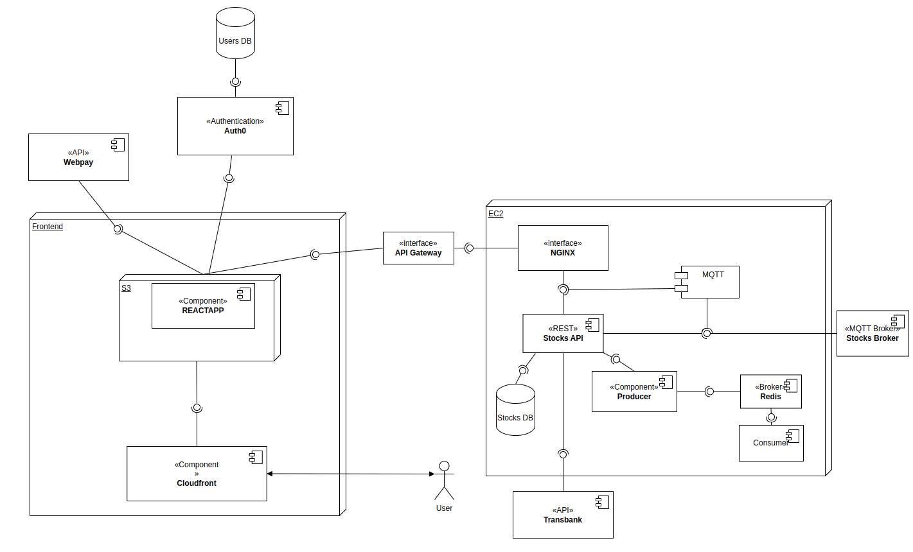

# Diagrama de componentes
## Frontend
En el diagrama se puede apreciar dentro del frontend el componente **REACTAPP** que  es una aplicacion en react, esta aplicacion esta conformada por componentes y porlotanto depende de ellos para su funcionamiento.
Los Archivos de reactAPP estan alojados en S3 y mediante cloudfront el usuario puede acceder al frontend.
A su vez para la autentificacion de usuario el frontend ocupa auth0 de forma externa.
Tambien para el pago de las compras, el usuario es redirigido a pagar en plataforma de webpay y luego redireccionado devuelta.

## Backend
Cuando se realiza algun request desde react APP hasta el backend, este se realiza mediante la api Gateway que ademas de realizar autentificacion, redirecciona hacia una instancia EC2 donde se encuentra Fastapi que maneja el backend.

Fastapi tiene un modulo mqtt que se encarga de escuchar las validaciones y stocks recibidas desde el broker. Fastapi tambien es la encargada de hacer las publish de las solicitudes de compra y manejar la base de datos stocks.

Ademas para las funcionalidades de prediccion de stocks se ocupan workers para asi realizar un trabajo en paralelo de forma eficiente.

Para las transacciones y sus pagos se ocupan las funciones de la libreria transbank-sdk que se comunica con una api de transbank monitorear el estado de las transacciones

